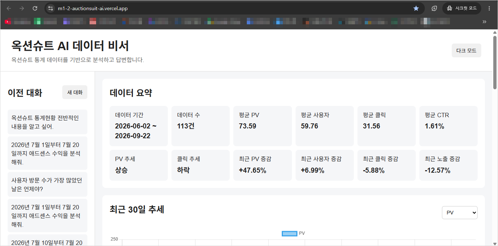
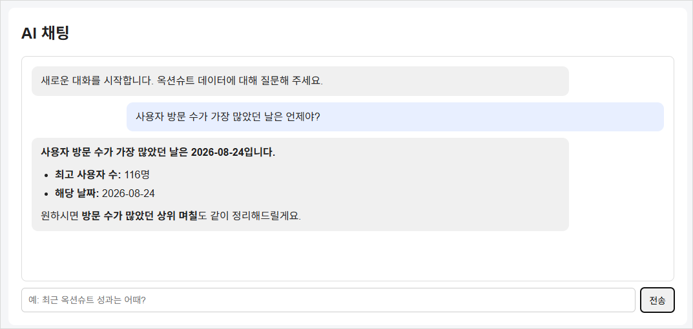
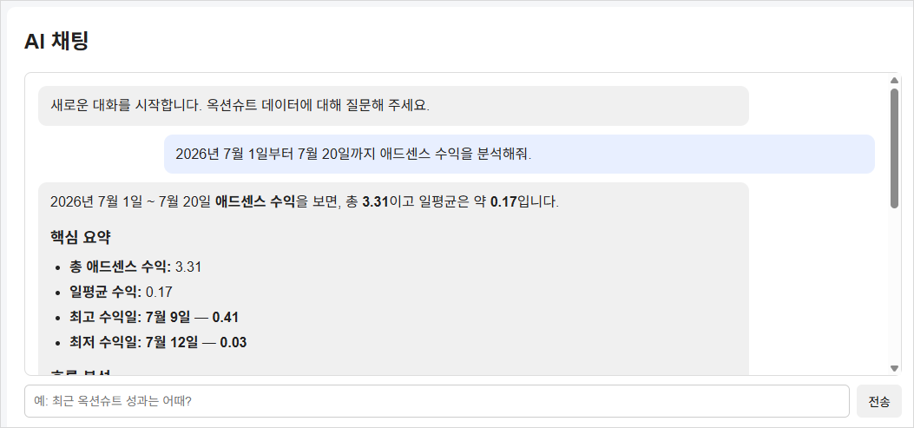
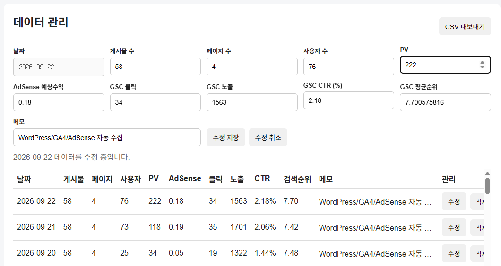
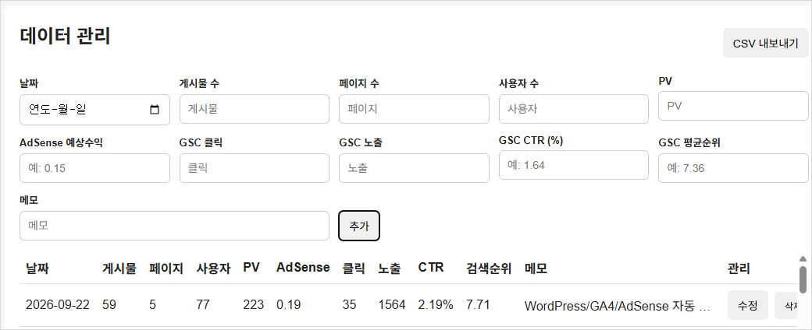
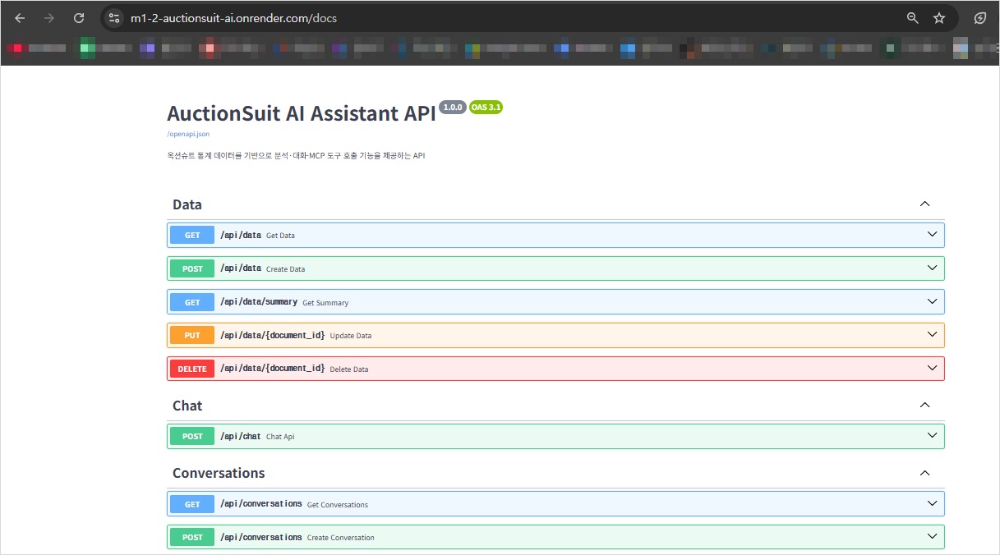
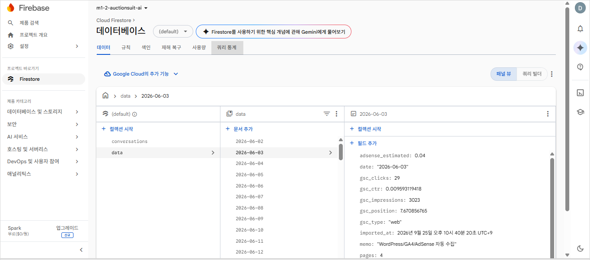
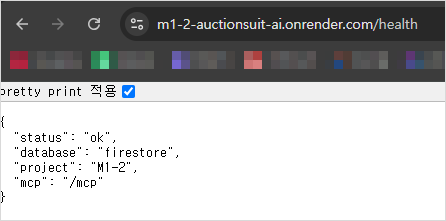
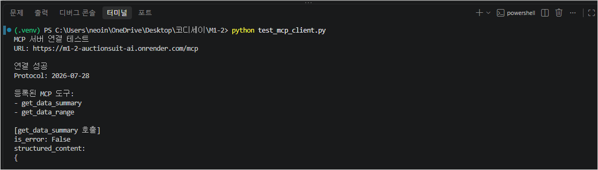

# M1-2: AI Agent 개발 - 옥션슈트 AI 데이터 비서

옥션슈트(AuctionSuit) 통계 데이터를 Firebase Firestore에 저장하고, 실제 데이터를 기반으로 질의응답·기간 분석·대화 저장·CRUD·시각화까지 수행하는 AI 데이터 비서입니다.

이번 과제에서는 FastAPI 기반 백엔드, Firestore 데이터베이스, Codyssey의 OpenAI 호환 LLM API, Vanilla JavaScript 프론트엔드를 결합했습니다. 또한 보너스 과제로 GPT Function Calling, MCP Server, 추가 통계 지표, 그래프, CSV 내보내기, 다크 모드까지 구현했습니다.

---

## 1. 배포 주소

| 구분 | 주소 |
|---|---|
| Frontend | https://m1-2-auctionsuit-ai.vercel.app |
| Backend | https://m1-2-auctionsuit-ai.onrender.com |
| Swagger API | https://m1-2-auctionsuit-ai.onrender.com/docs |
| Health Check | https://m1-2-auctionsuit-ai.onrender.com/health |
| MCP Endpoint | https://m1-2-auctionsuit-ai.onrender.com/mcp |

> Render 무료 인스턴스는 일정 시간 사용하지 않으면 휴면 상태로 전환될 수 있어 첫 요청이 다소 늦을 수 있습니다.

---

## 2. 프로젝트 개요

이 프로젝트는 옥션슈트 통계 데이터를 활용하여 다음 기능을 제공하는 AI 비서를 구현하는 것이 목적입니다.

- 실제 Firestore 데이터 기반 AI 채팅
- 기간별 시계열 데이터 조회 및 분석
- 데이터 CRUD(Create, Read, Update, Delete)
- 대화 자동 저장 및 이전 대화 불러오기
- 데이터 요약·추세·증감률 계산
- 최근 30일 그래프 시각화
- CSV 내보내기
- 다크 모드
- GPT Function Calling
- MCP Server를 통한 외부 도구 호출

---

## 3. 사용 데이터

기존 옥션슈트 통계 Google Sheets의 데이터를 기반으로 과제용 Firestore 데이터셋을 구성했습니다.

### 데이터 범위

- 기간: `2026-06-02 ~ 2026-09-22`
- 데이터 수: `113건`
- 기준: `daily_stats`와 `gsc_daily`에 모두 존재하는 공통 날짜
- 저장 단위: 날짜별 1개 Firestore Document

### 주요 필드

| 필드 | 설명 |
|---|---|
| `date` | 통계 날짜 |
| `value` | 과제 필수 대표값, `pv`와 동일하게 관리 |
| `memo` | 메모 |
| `posts` | 게시물 수 |
| `pages` | 페이지 수 |
| `users` | 사용자 수 |
| `pv` | 페이지뷰 |
| `adsense_estimated` | AdSense 예상수익 |
| `gsc_type` | Search Console 검색 유형 |
| `gsc_clicks` | GSC 클릭 수 |
| `gsc_impressions` | GSC 노출 수 |
| `gsc_ctr` | GSC CTR |
| `gsc_position` | GSC 평균 검색순위 |

`value`는 과제 필수 스키마를 유지하기 위해 `pv`와 동일한 값으로 자동 동기화합니다.

---

## 4. 기술 스택

| 영역 | 기술 |
|---|---|
| Backend | Python, FastAPI, Uvicorn |
| Database | Firebase Firestore |
| LLM | Codyssey OpenAI-compatible API |
| Default Model | `gpt-5.4-mini` |
| Frontend | HTML, CSS, Vanilla JavaScript |
| Chart | Chart.js |
| Markdown | marked.js |
| HTML Sanitizing | DOMPurify |
| MCP | MCP Python SDK |
| Backend Deploy | Render |
| Frontend Deploy | Vercel |
| Source Control | Git, GitHub |

---

## 5. 시스템 아키텍처

```mermaid
flowchart LR
    A[사용자] --> B[Vercel Frontend]
    B --> C[Render FastAPI Backend]

    C --> D[Firebase Firestore]
    C --> E[Codyssey OpenAI-compatible API]

    E --> F[GPT Function Calling]
    F --> G[get_data_summary]
    F --> H[get_data_range]

    I[외부 MCP Client] --> J[/mcp]
    J --> C

    D --> K[data Collection]
    D --> L[conversations Collection]
```

### 데이터 기반 AI 응답 흐름

```text
사용자 질문
   ↓
POST /api/chat
   ↓
Firestore 데이터 요약 조회
   ↓
요약 정보를 System Prompt에 주입
   ↓
필요 시 Function Calling
   ↓
get_data_summary 또는 get_data_range 실행
   ↓
실제 데이터 기반 GPT 답변 생성
   ↓
Firestore conversations 컬렉션에 자동 저장
```

---

## 6. Firestore 구조

### `data`

날짜별 통계 데이터를 저장합니다.

```text
data
 ├─ 2026-06-02
 │   ├─ date
 │   ├─ value
 │   ├─ users
 │   ├─ pv
 │   ├─ adsense_estimated
 │   ├─ gsc_clicks
 │   ├─ gsc_impressions
 │   ├─ gsc_ctr
 │   ├─ gsc_position
 │   └─ memo
 │
 └─ ...
```

Document ID는 ISO 날짜 형식인 `YYYY-MM-DD`를 사용합니다.

### `conversations`

AI 대화 기록을 저장합니다.

```text
conversations
 └─ {conversation_id}
     ├─ title
     ├─ created_at
     ├─ updated_at
     ├─ messages[]
     └─ last_tool_calls
```

---

## 7. 구현 기능

### 7.1 데이터 기반 AI 채팅

`POST /api/chat` 요청이 들어오면 Firestore의 실제 데이터를 기반으로 요약 정보를 생성하고, 이를 System Prompt에 포함하여 LLM에 전달합니다.

데이터만으로 판단할 수 없는 내용은 추측하지 않도록 프롬프트를 구성했으며, 최고값·최저값·추세·특정 기간 분석 등 데이터 분석 질문에 답할 수 있습니다.

예시 질문:

```text
사용자 방문 수가 가장 많았던 날은 언제야?
```

실제 데이터 기준 응답:

```text
2026-08-24, 116명
```

또한 특정 기간을 질문하면 Function Calling을 사용해 실제 일별 데이터를 추가 조회합니다.

```text
2026년 7월 1일부터 7월 20일까지 애드센스 수익을 분석해줘.
```

### 7.2 데이터 CRUD

프론트엔드에서 다음 항목을 직접 추가·조회·수정·삭제할 수 있습니다.

- 날짜
- 게시물 수
- 페이지 수
- 사용자 수
- PV
- AdSense 예상수익
- GSC 클릭
- GSC 노출
- GSC CTR
- GSC 평균순위
- 메모

수정 시 날짜는 Firestore Document ID이므로 변경하지 않도록 처리했습니다.

CTR은 화면에서는 `%` 단위로 입력하고, Firestore에는 소수값으로 변환하여 저장합니다.

예:

```text
화면 입력: 1.64
Firestore 저장: 0.0164
```

### 7.3 대화 저장 및 불러오기

AI 채팅은 Firestore `conversations` 컬렉션에 자동 저장됩니다.

- 새 대화 생성
- 대화 제목 자동 생성
- 이전 대화 목록 조회
- 특정 대화 불러오기
- 대화 메시지 복원

### 7.4 데이터 요약

`GET /api/data/summary`에서 다음 정보를 계산합니다.

- 데이터 기간
- 데이터 수
- 평균 사용자 수
- 평균 PV
- 최대/최소 PV
- 평균 GSC 클릭
- 평균 GSC 노출
- 평균 CTR
- 평균 검색순위
- 평균 AdSense 예상수익
- 총 AdSense 예상수익
- 최고 사용자 수와 날짜
- 최고 PV와 날짜
- 최고 AdSense 수익과 날짜
- 최고 GSC 클릭/노출/CTR과 날짜
- 최근 추세
- 최근 7일 vs 이전 7일 증감률

### 최근 7일 비교 지표

최근 7일 평균과 그 이전 7일 평균을 비교하여 다음 증감률을 계산합니다.

- PV
- 사용자
- GSC 클릭
- GSC 노출
- GSC CTR

---

## 8. API 목록

### Data

| Method | Endpoint | 설명 |
|---|---|---|
| POST | `/api/data` | 데이터 생성 |
| GET | `/api/data` | 전체 데이터 조회 |
| GET | `/api/data/summary` | 데이터 요약 조회 |
| PUT | `/api/data/{id}` | 데이터 수정 |
| DELETE | `/api/data/{id}` | 데이터 삭제 |

### Chat

| Method | Endpoint | 설명 |
|---|---|---|
| POST | `/api/chat` | 데이터 기반 AI 채팅 |

### Conversations

| Method | Endpoint | 설명 |
|---|---|---|
| POST | `/api/conversations` | 대화 생성 |
| GET | `/api/conversations` | 대화 목록 조회 |
| GET | `/api/conversations/{id}` | 특정 대화 조회 |
| DELETE | `/api/conversations/{id}` | 대화 삭제 |

### 기타

| Method | Endpoint | 설명 |
|---|---|---|
| GET | `/` | API 기본 응답 |
| GET | `/health` | 서버·Firestore 상태 확인 |
| MCP | `/mcp` | MCP Streamable HTTP Endpoint |

---

## 9. 보너스 1 - GPT Function Calling

GPT가 사용자의 질문을 분석하여 필요한 경우 내부 데이터 조회 기능을 도구로 호출하도록 구현했습니다.

### 등록 도구

#### `get_data_summary`

전체 데이터 요약 정보를 반환합니다.

사용 예:

```text
사용자 방문 수가 가장 많았던 날은 언제야?
```

요약 데이터에 이미 최고값과 날짜가 있으므로 별도의 기간 조회 없이 답변할 수 있습니다.

#### `get_data_range`

특정 날짜 범위의 실제 일별 데이터를 반환합니다.

입력:

```json
{
  "start_date": "2026-07-01",
  "end_date": "2026-07-20"
}
```

사용 예:

```text
2026년 7월 1일부터 7월 20일까지 애드센스 수익을 분석해줘.
```

LLM은 특정 기간의 실제 데이터가 필요하다고 판단하면 `get_data_range`를 호출한 뒤 조회 결과를 근거로 답변합니다.

---

## 10. 보너스 1 - MCP Server

Function Calling과 동일한 데이터 조회 기능을 외부 MCP Client에서도 사용할 수 있도록 MCP Server를 구현했습니다.

### MCP Endpoint

```text
https://m1-2-auctionsuit-ai.onrender.com/mcp
```

### 제공 도구

```text
get_data_summary
get_data_range
```

### 공개 MCP 테스트

`test_mcp_client.py`를 이용해 Render에 배포된 공개 MCP Server에 직접 연결했습니다.

테스트 결과:

```text
연결 성공
Protocol: 2026-07-28

등록된 MCP 도구:
- get_data_summary
- get_data_range

[get_data_summary 호출]
is_error: False

[get_data_range 호출]
is_error: False
```

`get_data_summary`는 전체 요약 통계를, `get_data_range`는 지정한 기간의 실제 Firestore 데이터를 정상 반환했습니다.

---

## 11. 보너스 2

### 추가 통계 지표

최근 7일 평균과 이전 7일 평균을 비교하여 증감률을 계산합니다.

예시:

```text
PV       +47.65%
사용자    +6.99%
클릭      -5.88%
노출     -12.57%
CTR       +6.61%
```

### 최근 30일 그래프

Chart.js를 사용해 최근 30일의 지표를 선 그래프로 표시합니다.

선택 가능한 지표:

- PV
- 사용자
- GSC 클릭
- GSC 노출
- AdSense 예상수익

### CSV 내보내기

현재 Firestore 데이터를 CSV 파일로 다운로드할 수 있습니다.

Excel에서 한글이 깨지지 않도록 UTF-8 BOM을 포함하여 생성합니다.

### 다크 모드

라이트/다크 모드 전환 기능을 구현했습니다.

선택 상태는 `localStorage`에 저장되어 새로고침 후에도 유지됩니다.

---

## 12. 프로젝트 구조

```text
M1-2/
├─ app/
│  ├─ config/
│  │  └─ firebase.py
│  │
│  ├─ models/
│  │  ├─ chat.py
│  │  ├─ conversation.py
│  │  └─ data.py
│  │
│  ├─ routers/
│  │  ├─ chat.py
│  │  ├─ conversations.py
│  │  └─ data.py
│  │
│  ├─ services/
│  │  ├─ chat_service.py
│  │  ├─ conversation_service.py
│  │  └─ data_service.py
│  │
│  ├─ main.py
│  └─ mcp_server.py
│
├─ frontend/
│  ├─ index.html
│  ├─ styles.css
│  ├─ config.js
│  └─ app.js
│
├─ screenshots/
│  ├─ 01_main_dashboard.png
│  ├─ 02_ai_chat_summary.png
│  ├─ 03_function_calling.png
│  ├─ 04_crud_edit.png
│  ├─ 05_crud_updated.png
│  ├─ 06_swagger_api.png
│  ├─ 07_firestore.png
│  ├─ 08_render_health.png
│  └─ 09_mcp_public_test.png
│
├─ import_to_firestore.py
├─ test_codyssey.py
├─ test_firebase.py
├─ test_function_calling.py
├─ test_mcp_client.py
├─ requirements.txt
├─ .env.example
├─ .gitignore
└─ README.md
```

---

## 13. 로컬 실행 방법

### 1) 저장소 준비

```bash
git clone <repository-url>
cd M1-2
```

### 2) 가상환경 생성

Windows:

```powershell
python -m venv .venv
.venv\Scripts\activate
```

### 3) 패키지 설치

```powershell
python -m pip install -r requirements.txt
```

### 4) 환경변수 설정

프로젝트 루트에 `.env` 파일을 생성합니다.

```env
FIREBASE_SERVICE_ACCOUNT_PATH=secrets/firebase-service-account.json

CODYSSEY_API_KEY=
CODYSSEY_BASE_URL=
CODYSSEY_MODEL=gpt-5.4-mini

GOOGLE_SHEETS_ID=

ALLOWED_ORIGINS=http://127.0.0.1:5500,http://localhost:5500
```

실제 API Key와 Firebase 서비스 계정 JSON은 GitHub에 업로드하지 않습니다.

### 5) Backend 실행

```powershell
uvicorn app.main:app --reload
```

Backend:

```text
http://127.0.0.1:8000
```

Swagger:

```text
http://127.0.0.1:8000/docs
```

### 6) Frontend 실행

새 터미널에서:

```powershell
cd frontend
python -m http.server 5500
```

Frontend:

```text
http://127.0.0.1:5500
```

---

## 14. 배포 환경

### Render

FastAPI Backend를 Render Web Service로 배포했습니다.

Build Command:

```text
pip install -r requirements.txt
```

Start Command:

```text
uvicorn app.main:app --host 0.0.0.0 --port $PORT
```

Render에서는 로컬 서비스 계정 파일을 사용하지 않고 `FIREBASE_SERVICE_ACCOUNT_JSON` 환경변수에 Firebase 서비스 계정 정보를 저장하여 Firestore에 연결합니다.

### Vercel

`frontend` 폴더를 Vercel Root Directory로 지정해 정적 사이트로 배포했습니다.

```text
Framework Preset: Other
Root Directory: frontend
```

프론트엔드의 `config.js`에서 Render Backend URL을 사용합니다.

---

## 15. 환경변수 및 보안

`.gitignore`를 통해 다음 파일을 Git에서 제외합니다.

```gitignore
.venv/
__pycache__/
*.pyc

.env
secrets/

.vscode/
.DS_Store
```

API Key와 Firebase Private Key는 소스코드에 직접 작성하지 않고 환경변수로 관리합니다.

---

## 16. 실행 화면

### 16.1 최종 메인 대시보드



데이터 요약, 최근 30일 그래프, 이전 대화 목록을 확인할 수 있습니다.

### 16.2 실제 데이터 기반 AI 채팅



Firestore의 실제 데이터 요약을 기반으로 최고 사용자 수와 해당 날짜 등을 답변합니다.

### 16.3 GPT Function Calling



특정 날짜 범위가 포함된 질문에서는 `get_data_range` 도구를 호출하여 실제 기간 데이터를 조회하고 분석합니다.

### 16.4 CRUD 수정 화면



날짜를 제외한 주요 통계 필드를 직접 수정할 수 있습니다.

### 16.5 CRUD 수정 결과



수정된 데이터가 Firestore와 화면에 정상 반영됩니다.

### 16.6 Swagger API



FastAPI가 제공하는 데이터, 채팅, 대화 관련 API를 Swagger에서 확인할 수 있습니다.

### 16.7 Firebase Firestore



`data`와 `conversations` 컬렉션을 Firestore에서 관리합니다.

### 16.8 Render Health Check



Render 배포 상태, Firestore 연결 및 MCP Endpoint 마운트를 확인했습니다.

### 16.9 공개 MCP Server 테스트



Render의 공개 MCP Endpoint에 외부 MCP Client로 연결하여 도구 목록 조회와 실제 도구 호출을 검증했습니다.

---

## 17. 과제 요구사항 대응

| 과제 요구사항 | 구현 내용 | 상태 |
|---|---|---|
| 100개 이상의 시계열 데이터 | 옥션슈트 날짜별 통계 113건 | ✅ |
| Firestore `data` 컬렉션 | 날짜별 Document 저장 | ✅ |
| Firestore `conversations` 컬렉션 | AI 대화 자동 저장 | ✅ |
| 데이터 생성 | `POST /api/data` | ✅ |
| 데이터 조회 | `GET /api/data` | ✅ |
| 데이터 수정 | `PUT /api/data/{id}` | ✅ |
| 데이터 삭제 | `DELETE /api/data/{id}` | ✅ |
| 데이터 요약 | `GET /api/data/summary` | ✅ |
| 데이터 요약 Context Injection | System Prompt에 실제 요약 정보 주입 | ✅ |
| AI 채팅 | `POST /api/chat` | ✅ |
| 대화 저장 | Firestore 자동 저장 | ✅ |
| 대화 목록 | `GET /api/conversations` | ✅ |
| 특정 대화 불러오기 | `GET /api/conversations/{id}` | ✅ |
| 대화 삭제 | `DELETE /api/conversations/{id}` | ✅ |
| 로딩 UI | AI 응답 대기 상태 표시 | ✅ |
| Vanilla HTML/CSS/JS | 프론트엔드 프레임워크 미사용 | ✅ |
| Backend 배포 | Render | ✅ |
| Frontend 배포 | Vercel | ✅ |
| Swagger URL | Render `/docs` | ✅ |
| 환경변수 관리 | `.env`, Render Environment Variables | ✅ |
| Function Calling | `get_data_summary`, `get_data_range` | ✅ |
| MCP Server | 공개 `/mcp` Endpoint | ✅ |
| 추가 통계 지표 | 7일 비교 증감률 | ✅ |
| 그래프 | 최근 30일 Chart.js | ✅ |
| CSV/JSON Export | CSV 다운로드 | ✅ |
| Dark Mode | localStorage 기반 다크 모드 | ✅ |

---

## 18. 구현 결과

필수 과제뿐 아니라 두 가지 보너스 영역을 모두 구현했습니다.

### 필수 기능

- 데이터 기반 AI 채팅
- Firestore CRUD
- 대화 저장/불러오기
- FastAPI Router/Service 분리
- Pydantic Validation
- Render/Vercel 배포
- Swagger 문서 제공

### 보너스 1

- GPT Function Calling
- MCP Server
- 공개 MCP Endpoint를 외부 Client에서 직접 호출하여 검증

### 보너스 2

- 추가 통계 지표
- 최근 30일 그래프
- CSV 내보내기
- 다크 모드

옥션슈트의 실제 통계 데이터를 단순 조회하는 수준을 넘어, AI가 필요한 데이터를 판단하여 도구로 조회하고 실제 수치에 근거해 분석하는 데이터 기반 AI 비서 형태로 구현했습니다.
